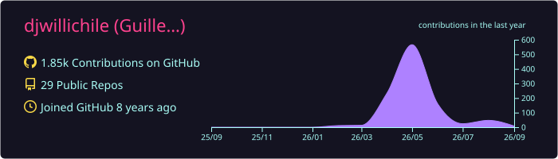
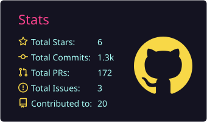
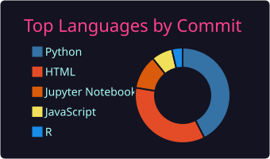
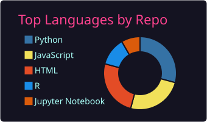
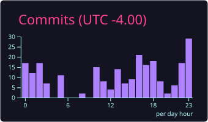

  

# Guillermo S. Fuentes Jaque
### Geospatial Data Scientist | Environmental Modeler | Academic Leader

  
  
  
  

👋 ¡Hola! Soy Guillermo, un profesional con más de 10 años de experiencia liderando la convergencia entre **ciencia de datos, modelamiento ambiental y geomática**. Mi carrera se ha centrado en transformar datos crudos (satelitales, climáticos, territoriales) en **soluciones estratégicas y productos de datos de alto impacto**.

Como **Consultor Senior** y **Coordinador Académico**, mi trabajo abarca desde la dirección de consultorías complejas para la gran minería y el sector público, hasta la formación de la próxima generación de expertos en tecnología geoespacial. Este portafolio es una muestra de mi doble pasión: resolver problemas del mundo real con código y compartir ese conocimiento.

---

### 🛠️ Stack Tecnológico Principal

**Geomática & Teledetección:**
`ArcGIS Pro/Online` `QGIS` `Google Earth Engine` `PostGIS` `GRASS` `SAGA` `FRAGSTATS`

**Ciencia de Datos & ML:**
`Python (Scikit-Learn, GeoPandas, Rasterio)` `R (Tidyverse, Caret, Shiny)` `SQL` `XGBoost` `SHAP`

**Modelamiento Ambiental:**
`MODFLOW` `WEAP` `CALPUFF` `AERMOD` `OpenAir (R)` `Stella` `Vensim`

**BI & Desarrollo Web:**
`Power BI` `R Shiny` `Leaflet` `React` `JavaScript` `HTML/CSS`

---

### 🚀 Proyectos Destacados

#### 🛰️ [Monitoreo del Desierto Florido en la cuenca del Huasco](https://github.com/djwillichile/geoia-bloom-huasco)
**Teledetección aplicada a eventos de floración en ecosistemas áridos**
Flujo reproducible con MODIS MOD13Q1, Google Earth Engine y Python para construir climatologías NDVI, calcular anomalías y cuantificar eventos de bloom entre 2000–2026. Conecta monitoreo satelital, análisis temporal y comunicación científica aplicada a ecosistemas áridos.

#### 💧 [Análisis hidrometeorológico de Chile](https://github.com/djwillichile/analisis-hidrometeorologico-chile)
**Análisis hidroclimático reproducible de Chile central (2015–2024)**
Pipeline de Python automatizado para evaluar la disponibilidad hídrica y la sequía en Chile central usando datos ERA5-Land. Incluye cálculo de SPI, balance hídrico, análisis de tendencias (Mann-Kendall/Sen) y visualizaciones publicables.

#### 🌬️ [Eddy Covariance en Chile y la Patagonia](https://github.com/djwillichile/eddy-patagonia-chile) · [Ejemplo Colab](https://github.com/djwillichile/eddy-patagonia-colab)
**Estaciones para estudios ecosistémicos de carbono, agua y energía**
Pipeline reproducible para descubrir, descargar, estandarizar y analizar datos de estaciones de covarianza de remolinos (*eddy covariance*) en Chile y Sudamérica austral. Integra 6 estaciones validadas con datos 2014–2024 (+11.000 observaciones estandarizadas), interfaz web interactiva y un notebook de Google Colab para demostración *end-to-end* de los flujos de carbono, agua y energía en ecosistemas patagónicos.

#### 📈 [tempify — Densificación temporal de ráster climáticos](https://github.com/djwillichile/tempify)
**Librería Python para convertir series mensuales en diarias**
Convierte series mensuales en series diarias preservando propiedades estadísticas críticas, con aplicación en bioclimatología, hidrología, agroclima y modelación ambiental. Incluye CLI, API Python, tests, tutoriales y documentación técnica.

#### 🌍 [spEnviroDistr — Análisis espacial ambiental en R](https://github.com/djwillichile/spEnviroDistr)
**Paquete R para distribución espacial de variables ambientales**
Implementa GWR (Geographically Weighted Regression) con procesamiento en paralelo, downscaling, imputación espacial y preparación de capas predictoras para modelación ambiental.

#### 🌱 [spAgroClimate — Indicadores agroclimáticos en R](https://github.com/djwillichile/paquetes-spAgroClimate)
**Librería de R especializada en análisis agroclimático**
Automatización de indicadores agroclimáticos (horas frío, acumulación térmica) para la agricultura de precisión. Proyecto en evolución activa orientado a uso en campo y docencia.

---

### 📊 Ciencia de Datos Aplicada

Proyectos de análisis y modelamiento aplicados a sectores fuera del ámbito ambiental, orientados a negocio y sector público.

#### 🏛️ [Análisis estratégico de compras públicas en Chile](https://github.com/djwillichile/chile-public-procurement-analysis)
**Mercado ChileCompra 2019–2025**
Pipeline de análisis sobre más de 807.000 licitaciones de ChileCompra, con ETL para datasets de +30 GB, índice de oportunidad de mercado por sector y modelos Prophet/XGBoost para proyecciones 2025–2028. Identifica sectores con mayor crecimiento de demanda estatal e incluye visualizaciones interactivas publicadas vía GitHub Actions. El procesamiento masivo está modularizado en [chilecompra-data-processor](https://github.com/djwillichile/chilecompra-data-processor).

#### 🤖 [Monitoreo de modelos ML en producción](https://github.com/djwillichile/monitoreoML)
**Framework de Data Drift y degradación de performance**
Framework integral para detectar Data Drift y degradación de performance en modelos de producción, asegurando la trazabilidad en pipelines de datos territoriales.

#### 📉 [Predicción de Churn en Telecomunicaciones](https://github.com/djwillichile/churnTelecom)
**Pipeline ML End-to-End con XGBoost, LightGBM y SHAP**
Pipeline completo para identificar clientes en riesgo de abandono: ingeniería de características, comparación de modelos (XGBoost, LightGBM, Regresión Logística), manejo de desbalance con SMOTE e interpretabilidad con SHAP. Mejor modelo alcanza ROC-AUC de 0.85 sobre el dataset IBM Telco (7.043 clientes).

#### 👥 [Segmentación de Clientes con RFM, K-Means y CLV](https://github.com/djwillichile/segmentacionClientes)
**Perfiles accionables para retención y cross-selling**
Pipeline de segmentación no supervisada basado en análisis RFM, K-Means y clustering jerárquico, con estimación de Customer Lifetime Value (CLV) por segmento. Genera perfiles accionables con estrategias de retención, cross-selling y comunicación personalizadas para cada grupo de clientes.

---

### 🎓 Tesis de Postgrado

#### 🌵 [Precipitación en alta resolución en el desierto de Atacama (CHIRPS)](https://github.com/djwillichile/tesis-atacama-chirps)
**Tesis de Magíster — Universidad de Chile**
Desarrollo de un método para estimar la distribución espacial de la precipitación mensual en alta resolución en el desierto de Atacama (Chile) a partir de productos CHIRPS. Landing y repositorio dedicados a la tesis, centrada en downscaling de precipitación, modelamiento espacial y análisis territorial.

| Recurso | Enlace |
| --- | --- |
| Landing académica | https://djwillichile.github.io/tesis-atacama-chirps/ |
| Repositorio del proyecto | https://github.com/djwillichile/tesis-atacama-chirps |
| Repositorio institucional U. de Chile | https://repositorio.uchile.cl/handle/2250/200362 |
| PDF institucional | https://repositorio.uchile.cl/bitstream/handle/2250/200362/2022_Guillermo_Fuentes_Jaque.pdf |

---

### 📚 Docencia y Recursos Educativos

Materiales y guías reproducibles

#### 📖 [Guía sobre datos faltantes e imputación](https://github.com/djwillichile/missing-data-imputation)
**Recurso educativo reproducible en ciencia de datos**
Recurso técnico reproducible sobre estrategias para el manejo de valores ausentes en ciencia de datos. Cubre desde métodos simples (media, moda) hasta técnicas avanzadas (KNN, imputación múltiple), con código Python, visualizaciones y documentación completa publicada en GitHub Pages bajo licencia CC-BY 4.0.

#### 🧑‍🏫 [Aplicaciones y Tecnologías Web — USS](https://github.com/djwillichile/webapps-uss)
**Material docente del curso**
Repositorio de apoyo a la asignatura, con ejercicios y proyectos demostrativos para estudiantes.

---

### 🧪 Otros experimentos

Prototipos, dashboards y exploraciones

#### 💹 [Dashboard financiero interactivo](https://github.com/djwillichile/currency-dashboard)
**Full-Stack con React/Vite**
Dashboard financiero (React/Vite) que consume APIs en tiempo real, aplica un algoritmo de scoring y genera recomendaciones de inversión.

---

### 📖 Trayectoria e Impacto

*   **Investigación Científica:** Autor de más de 15 publicaciones, incluyendo artículos en *Scientific Reports (Nature)*, *Remote Sensing* e *Hydrology*. Mi trabajo se centra en la aplicación de teledetección para estudiar el cambio climático y sus efectos en recursos hídricos y ecosistemas.
*   **Consultoría Estratégica:** He liderado y participado en proyectos de alto perfil para clientes como **Anglo American, SQM, ENAP, Aguas Andinas, SAG, INE y CORFO**, desarrollando desde líneas base ambientales y modelamiento de dispersión hasta el rediseño territorial para el Censo 2024.
*   **Liderazgo Académico:** Como Coordinador y docente en 4 universidades chilenas (U. de Chile, U. San Sebastián, U. Mayor, U. Bernardo O'Higgins), he diseñado y liderado programas de formación en SIG, Data Science y Modelamiento Ambiental, además de dirigir capacitaciones para el sector público y privado.

---

  
  
  

  

  
  

  
  

---

*Mi objetivo es doble: aplicar la ciencia y la tecnología para resolver los desafíos ambientales más urgentes de nuestro tiempo, y empoderar a otros para que hagan lo mismo.*
